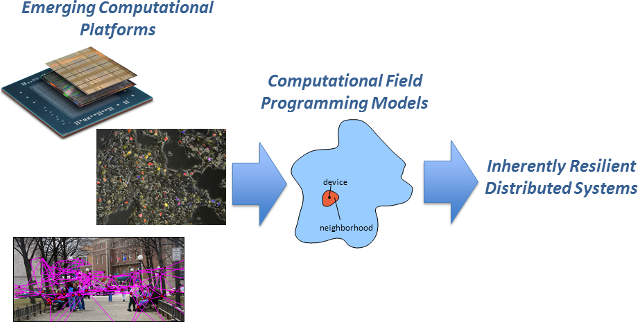
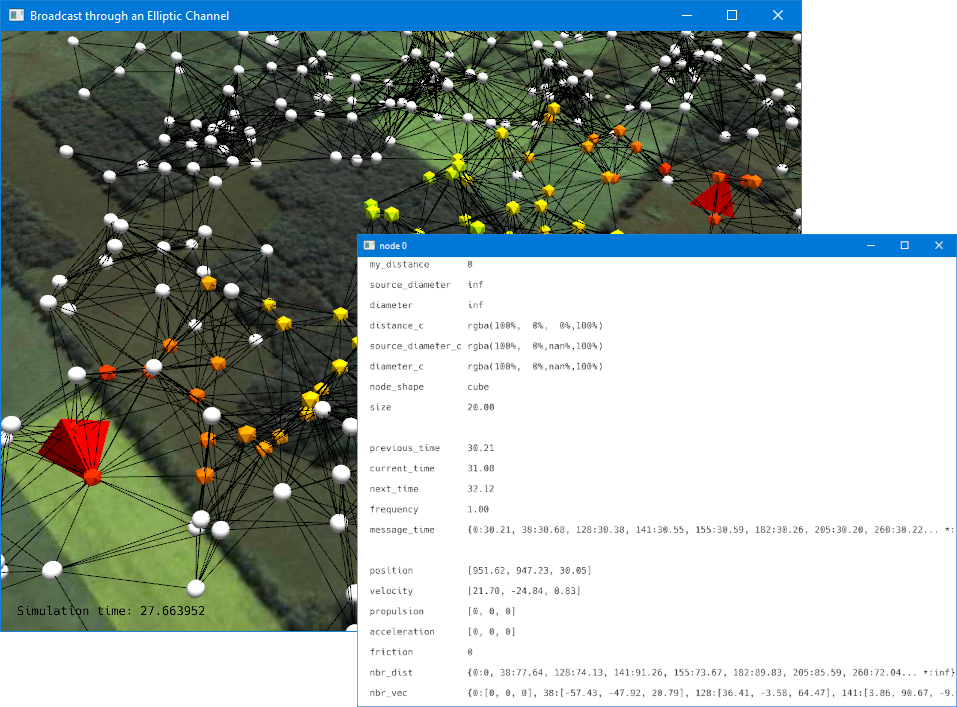

## Why?

FCPP aims to simplify the management of a resilient networked system out of an assortment of different potentially mobile devices. FCPP is designed for the _aggregate programming_ paradigm, a development pattern allowing the decomposition of applications into simple snippets of distributed behaviour with guaranteed resilience properties, with very low assumptions on the network structure, allowing for multiple forms of failures and mobility.

## What?

FCPP is an efficient and extensible C++14 implementation of the _field Calculus_, for fast and effective execution and simulation of aggregate programs for pervasive computing scenarios, large-scale computations on graph-based data, and deployment on microcontroller architectures.

It currently supports:
- deployment on microcontroller architectures
- portable multicore execution of both single simulations and batches
- programming distributed networks through field calculus
- simulation of both physical and logical networks
- 2D and 3D simulated environments with obstacles and basic physics
- OpenGL interface for simulations
- automatic plot generation on simulation batches

## How?

All you need to get started using FCPP is a C++ compiler and the CMake build system. Step-by-step tutorials are available to guide you familiarise with the paradigm: you can find them in the [getting started page](./quickstart.html).
